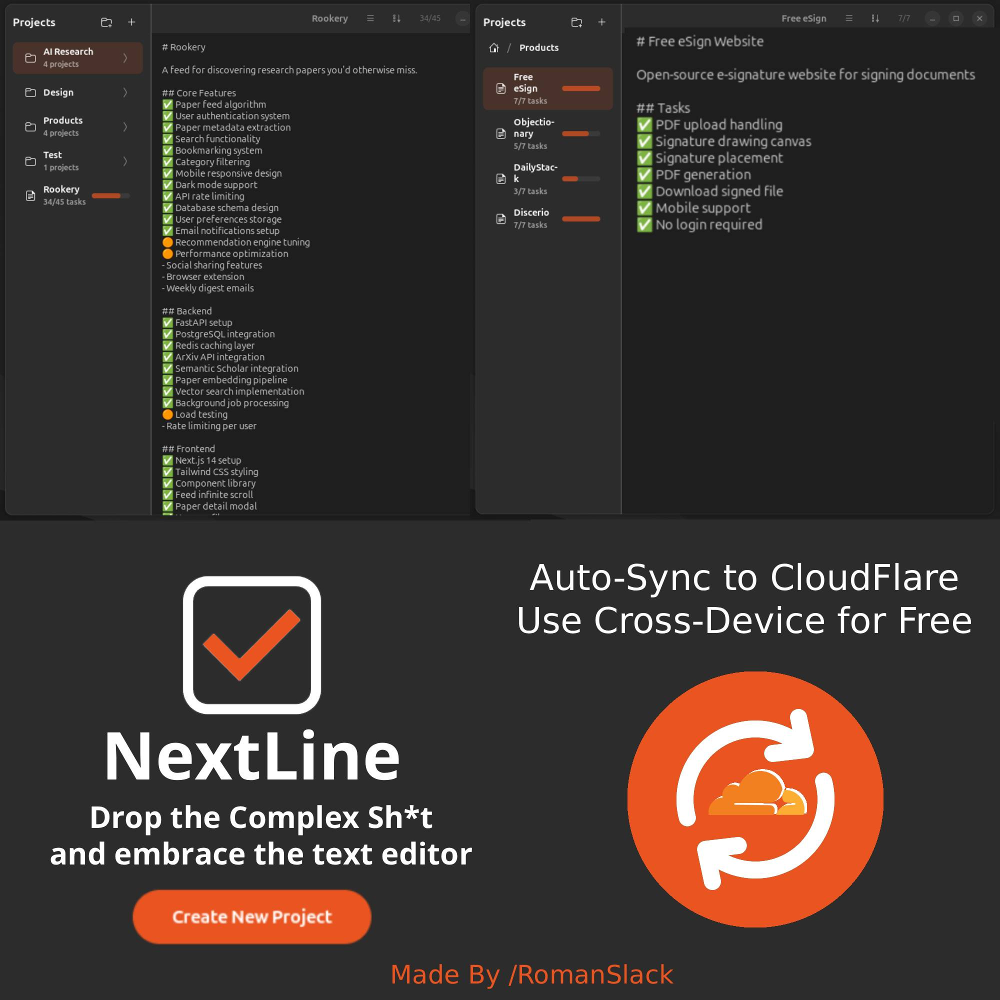

# NextLine


A simple, GNOME-style task manager with cloud sync.

Drop the complex sh*t and embrace the text editor.

<p align="center">
  
</p>

## Quick Install

```bash
git clone https://github.com/yourusername/nextline
cd nextline
./setup.sh
```

The setup wizard will:
- Build the app
- Create your personal sync server on Cloudflare (free)
- Configure everything automatically
- Install to your applications

## Features

- **Simple task management** - Create tasks with `-`, toggle status with Ctrl+D
- **Task states** - Pending → In Progress (🟠) → Done (✅)
- **Cloud sync** - Sync across devices with your own Cloudflare worker
- **Folders** - Organize projects into groups
- **Pinning** - Pin important projects to the top
- **Auto-save** - Never lose your work

## Requirements

- Linux with GTK4
- Rust 1.70+
- Node.js 18+ (for Cloudflare deployment)

### Ubuntu/Debian
```bash
sudo apt install libgtk-4-dev libadwaita-1-dev
```

### Fedora
```bash
sudo dnf install gtk4-devel libadwaita-devel
```

### Arch
```bash
sudo pacman -S gtk4 libadwaita
```

## Manual Setup

### 1. Build
```bash
cargo build --release
```

### 2. Deploy sync server
```bash
cd nextline-worker
npm install
npx wrangler login
npx wrangler r2 bucket create nextline-sync
npx wrangler deploy
npx wrangler secret put API_KEY  # paste: openssl rand -hex 32
```

### 3. Configure
Create `~/.config/nextline/config.json`:
```json
{
  "sync": {
    "enabled": true,
    "url": "https://nextline-sync.YOUR-SUBDOMAIN.workers.dev",
    "api_key": "YOUR_API_KEY"
  }
}
```

### 4. Run
```bash
./target/release/nextline
```

## Keyboard Shortcuts

| Key | Action |
|-----|--------|
| `Ctrl+D` | Toggle task status |
| `Enter` | New task (on task line) |
| `Ctrl+Enter` | New task (anywhere) |
| `Ctrl+S` | Save |
| `Ctrl+Z` | Undo |
| `Ctrl+Shift+Z` | Redo |

## Sync on Another Device

Copy `~/.config/nextline/config.json` to your other device, or run `./setup.sh` again.

## Cost

Free. Cloudflare's free tier (100k requests/day, 10GB storage) is plenty for personal use.

## Issues & Requests

Open an issue on GitHub if you run into problems or have feature requests.

## License

GPL-3.0
